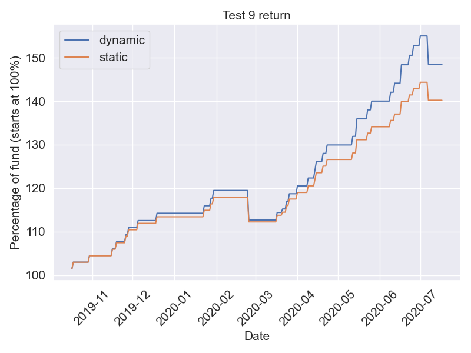
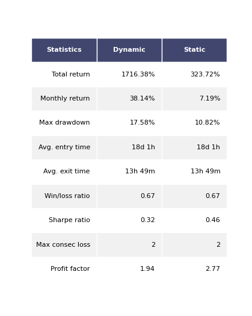
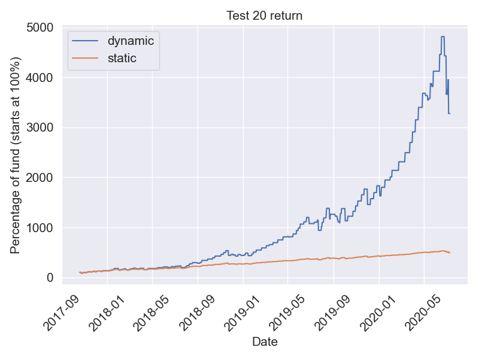
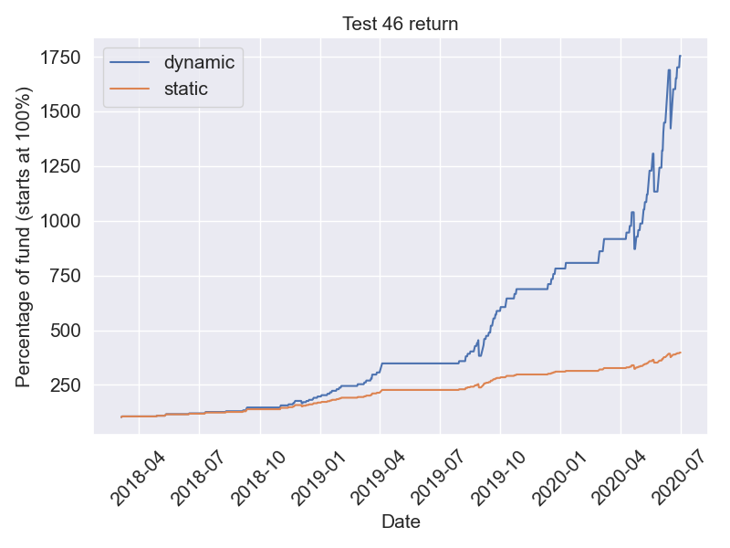
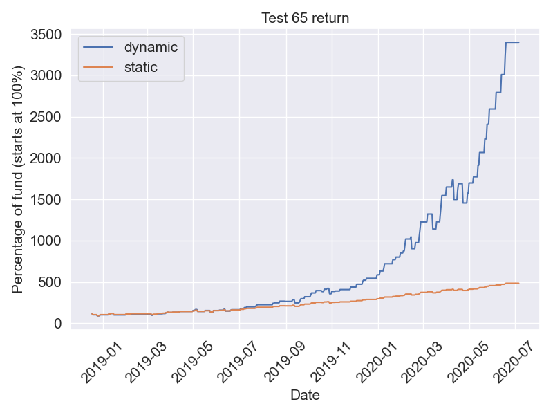

## Weekly summary

#### 2020.7.27~7.31
```
Mark I   +0.00%
Mark II  +6.65%
```

#### 2020.7.20~7.24
```
Mark I  +2.09%
```

#### 2020.7.13~7.17
```
Mark I  +2.56%
```

## Backtests
 <!--### Published strategies-->

#### Mark I
9 months backtest

   

#### Mark II
2 years 10 months (34 months) backtest

   

<!---
### Testing strategies

#### Test 1
3 years 3 months (39 months) backtest

   

#### Test 4
3 years 7 months (30 months) backtest

  

#### Test 6
2 years 6 months (30 months) backtest

   

#### Test 9
10 months (10 months) backtest

  

#### Test 10
3 years 3 months (39 months) backtest

  

#### Test 11
3 years 9 months (45 months) backtest

   

#### Test 13
3 years 3 months (39 months) backtest

   

#### Test 14
2 years 11 months (35 months) backtest

   

#### Test 15
2 years 11 months (35 months) backtest

   

#### Test 16
2 years 11 months (35 months) backtest

   

#### Test 17
2 years 9 months (33 months) backtest

   

#### Test 18
2 years 10 months (34 months) backtest

   

#### Test 19
2 years 10 months (34 months) backtest

   

#### Test 20
2 years 10 months (34 months) backtest

   

#### Test 21
2 years 10 months (34 months) backtest

   

#### Test 22
3 years 7 months (43 months) backtest

   

#### Test 23
2 years 11 months (35 months) backtest

   

#### Test 30
3 years 3 months (39 months) backtest

   

#### Test 31
3 years 7 months (43 months) backtest

  

#### Test 32
2 years 11 months (35 months) backtest

  

#### Test 38
2 years 7 months (31 months) backtest

  

#### Test 40
3 years 4 months (40 months) backtest

   

#### Test 41
3 years 3 months (39 months) backtest

   

#### Test 43
3 years 3 months (39 months) backtest

   

#### Test 46
2 years 6 months (30 months) backtest

   

#### Test 47
1 year 8 months (20 months) backtest

   

#### Test 48
2 years (24 months) backtest

   

#### Test 49
2 years 1 month (25 months) backtest

   

#### Test 50
2 years 1 month (25 months) backtest

   

#### Test 51
2 years 1 month (25 months) backtest

   

#### Test 52
2 years 1 month (25 months) backtest

   

#### Test 53
1 years 1 month (25 months) backtest

   

#### Test 54
1 year 1 month (13 months) backtest

   

#### Test 55
1 year 1 month (13 months) backtest

   

#### Test 56
1 year 1 month (13 months) backtest

   

#### Test 57
1 year 1 month (13 months) backtest

   

#### Test 59
2 years 8 months (32 months) backtest

   


#### Test 60
2 years 2 months (26 months) backtest

   

#### Test 61
9 months (9 months) backtest

   

#### Test 62
9 months (9 months) backtest

   

#### Test 63
2 years 6 months (30 months) backtest

   

#### Test 64
1 year 7 months (20 months) backtest

   

#### Test 65
1 year 7 months (20 months) backtest

  

#### Test 66
1 year 7 months (20 months) backtest

   

#### Test 67
1 year 4 months (16 months) backtest

   

#### Test 68
2 years 6 months (30 months) backtest

   

#### Test 69
1 year 8 months (20 months) backtest

   

#### Test 70
1 year 8 months (20 months) backtest

   

#### Test 71
1 year 8 months (20 months) backtest

   

#### Test 72
2 years 6 months (30 months) backtest

   

#### Test 73
1 year 8 months (20 months) backtest

   

#### Test 74
2 years 7 months (31 months) backtest

   

#### Test 75
1 year 8 months (20 months) backtest

   

#### Test 76
1 year 8 months (20 months) backtest

   

#### Test 77
1 year 8 months (20 months) backtest

   

#### Test 78
1 year 8 months (20 months) backtest

   

--->
