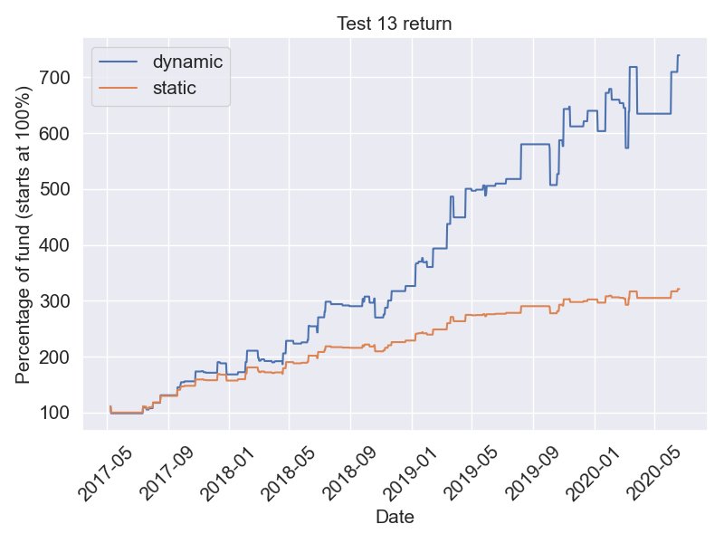

## Weekly summary (2020.7.13-7.17)

Mark I  +2.56%

## Backtests for running strategies
### Mark I
   

## Backtests for testing strategies
### Test 11
3 years 9 months (45 months) backtest

   

### Test 13
   

### Test 19
   
