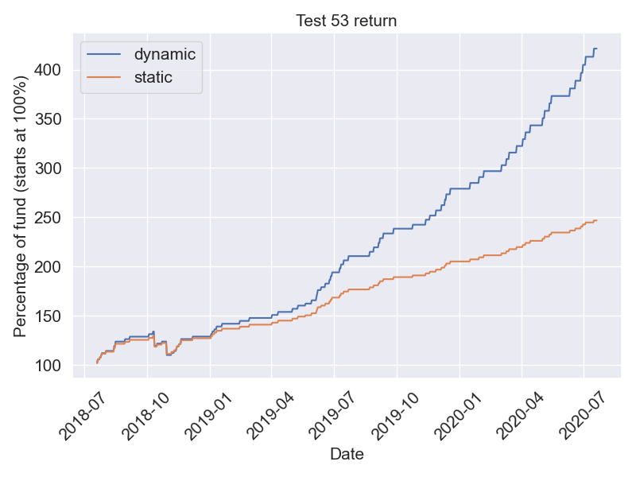
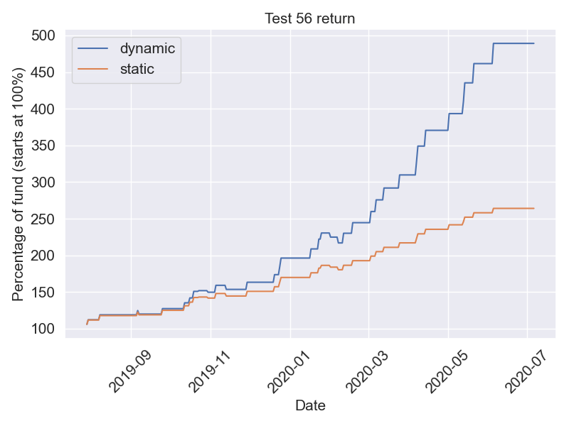
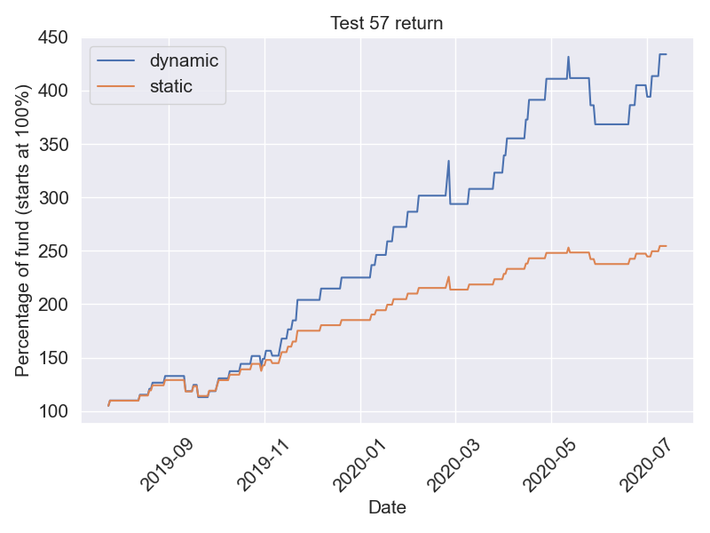
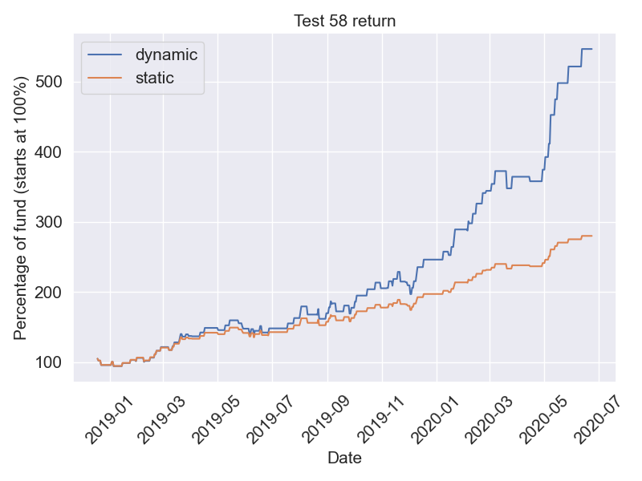
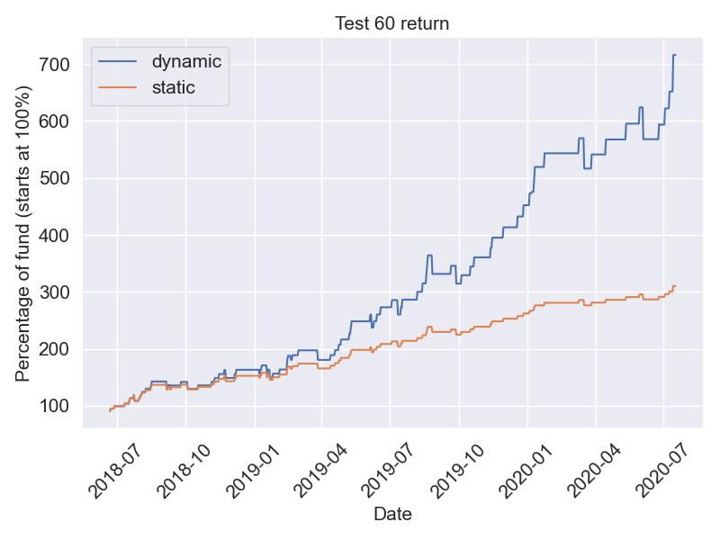
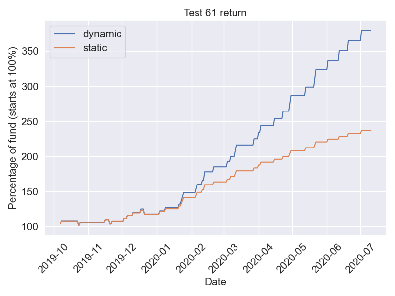

## Weekly summary
#### 2020.7.13-7.17
```
Mark I  +2.56%
```

## Backtests
### Published strategies

#### Mark I
9 months backtest

   


### Testing strategies

#### Test 1
3 years 3 months (39 months) backtest

   

#### Test 4
3 years 7 months (30 months) backtest

  

#### Test 6
2 years 6 months (30 months) backtest

   

#### Test 9
10 months (10 months) backtest

   

#### Test 11
3 years 9 months (45 months) backtest

   

#### Test 13
3 years 3 months (39 months) backtest

   

#### Test 15
2 years 11 months (35 months) backtest

   

#### Test 19
2 years 10 months (34 months) backtest

   

#### Test 22
3 years 7 months (43 months) backtest

   

#### Test 30
3 years 3 months (39 months) backtest

   

#### Test 30
3 years 7 months (43 months) backtest

   

#### Test 40
3 years 4 months (40 months) backtest

   

#### Test 41
3 years 3 months (39 months) backtest

   

#### Test 46
2 years 6 months (30 months) backtest

   

#### Test 47
1 year 8 months (20 months) backtest

   

#### Test 48
2 years (24 months) backtest

   

#### Test 49
2 years 1 month (25 months) backtest

   

#### Test 51
2 years 1 month (25 months) backtest

   

#### Test 52
2 years 1 month (25 months) backtest

   

#### Test 53
1 years 1 month (25 months) backtest

   

#### Test 54
1 year 1 month (13 months) backtest

   

#### Test 55
1 year 1 month (13 months) backtest

   

#### Test 56
1 year 1 month (13 months) backtest

   

#### Test 57
1 year 1 month (13 months) backtest

   

#### Test 58
2 years 8 months (32 months) backtest

   

#### Test 59
2 years 8 months (32 months) backtest

   


#### Test 60
2 years 2 months (26 months) backtest

   

#### Test 61
9 months (9 months) backtest

   
